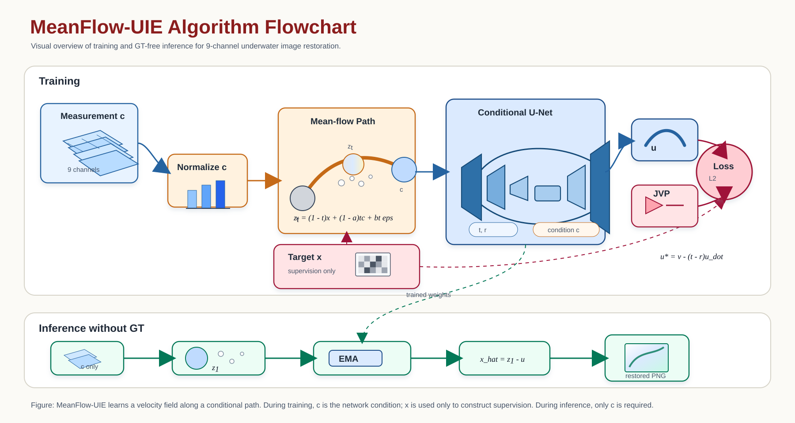

# One-Step Flow Matching for PDOI Reconstruction

This repository provides a PyTorch implementation of one-step conditional MeanFlow for PDOI image reconstruction. The model reconstructs a single-channel grayscale image from a nine-channel measurement stored in a MATLAB `.mat` file. It supports model training, inference without ground truth, quantitative evaluation with PSNR, EMA checkpoints, and distributed training through Hugging Face Accelerate.

## Method overview

The reconstruction network uses a conditional residual U-Net as its velocity-field model. During inference, MeanFlow starts from the normalized measurement condition with a small random-noise component and predicts the reconstructed image in one generation step from `t = 1` to `t = 0`.

The default configuration is:

| Setting | Value |
| --- | --- |
| Measurement channels | 9 |
| Reconstructed image channels | 1 |
| Image size | 64 × 64 |
| MAT variable name | `mea1` |
| U-Net channel multipliers | `(1, 2, 4, 8)` |
| Training steps | 600,000 |
| Batch size | 32 |
| Learning rate | `1e-4` |
| EMA decay | `0.995` |



## Get started

### 1. Clone the repository

Replace `<your-github-username>` with the account or organization that hosts the repository.

```bash
git clone https://github.com/<your-github-username>/One-Step-Flow-Matching-for-PDOI.git
cd One-Step-Flow-Matching-for-PDOI
```

### 2. Create and activate a Conda environment

Python 3.10 is recommended.

```bash
conda create -n meanflow-pdoi python=3.10 -y
conda activate meanflow-pdoi
```

### 3. Install dependencies

```bash
pip install -r requirements.txt
```

For GPU inference or training, install the PyTorch build compatible with your CUDA driver. Follow the installation command provided by the [official PyTorch website](https://pytorch.org/get-started/locally/) if the default `pip` installation does not provide the required CUDA build.

## Repository structure

```text
One-Step-Flow-Matching-for-PDOI/
├── data/
│   ├── paired_image_dataset.py    # Paired MAT/PNG dataset loader
│   └── test/
│       ├── input/                 # Test measurements (.mat)
│       └── gt/                    # Ground-truth grayscale images (.png)
├── figures/                       # Method diagrams used by this README
├── src/
│   ├── meanflow.py                # MeanFlow training and one-step inference
│   ├── UnetRes_Meanflow.py        # Conditional residual U-Net
│   ├── model.py                   # Supporting model components
│   └── trainer_loop.py            # Training, EMA, checkpoints, and validation
├── ckpt_single_dataset/
│   └── model-best.pt              # Default pretrained checkpoint location
├── train_meanflow.py              # Training entry point
├── test_meanflow_no_gt.py         # Inference without ground truth
├── test_meanflow_psnr.py          # Inference and PSNR evaluation
└── requirements.txt
```

Generated files are written under `results/` by default.

## Data preparation

Each input sample is a three-dimensional MATLAB array containing nine measurement channels. The loader accepts either of these layouts:

- `9 × H × W`
- `H × W × 9`

The default MATLAB variable name is `mea1`. If the requested key is absent, the loader uses the first non-metadata array found in the file. Each measurement stack is min-max normalized to `[0, 1]` and center-cropped to the configured image size.

Ground-truth images must be single-channel images. For PSNR evaluation, every `.mat` file must have a `.png` ground-truth image with the same stem. For example:

```text
data/test/
├── input/
│   ├── 10501.mat
│   ├── 10502.mat
│   └── ...
└── gt/
    ├── 10501.png
    ├── 10502.png
    └── ...
```

Images larger than 64 × 64 are center-cropped. Images smaller than the configured crop size produce an error.

## Pretrained checkpoint

Place the pretrained checkpoint at:

```text
ckpt_single_dataset/model-best.pt
```

Both test scripts load EMA weights by default when the checkpoint contains an `ema` state. Use `--no_ema` to load raw model weights instead.

You can select another checkpoint explicitly:

```bash
python test_meanflow_no_gt.py --checkpoint path/to/model.pt
```

The supplied checkpoint is larger than GitHub's normal single-file upload limit. Do not add it as an ordinary Git object. Publish it with Git LFS, a GitHub Release, or external storage, and add the download link here after publishing the repository.

## Inference without ground truth

Run reconstruction when only measurement `.mat` files are available:

```bash
python test_meanflow_no_gt.py
```

The default paths are:

| Purpose | Path |
| --- | --- |
| Input measurements | `data/test/input` |
| Checkpoint | `ckpt_single_dataset/model-best.pt` |
| Reconstructed images | `results/no_gt_test` |

The script prints the resolved output directory before inference and verifies that one PNG is saved for every input sample.

Example with custom paths and a specific GPU:

```bash
python test_meanflow_no_gt.py \
  --checkpoint ckpt_single_dataset/model-best.pt \
  --test_path data/test \
  --output_dir results/my_reconstructions \
  --device cuda:0
```

On Windows PowerShell, use a backtick instead of `\` for multiline commands, or place the command on one line.

Useful options:

| Argument | Default | Description |
| --- | --- | --- |
| `--test_path` | `data/test` | Directory containing `.mat` files, or a root containing `input/` |
| `--output_dir` | `results/no_gt_test` | Directory for reconstructed PNG files |
| `--image_size` | `64` | Center-crop size |
| `--batch_size` | `1` | Inference batch size |
| `--mat_key` | `mea1` | MATLAB array key |
| `--device` | automatic | `cpu`, `cuda`, or a device such as `cuda:0` |
| `--no_ema` | disabled | Load raw model parameters instead of EMA parameters |

## PSNR evaluation

When matching ground-truth PNG files are available, run:

```bash
python test_meanflow_psnr.py
```

The evaluator matches measurements and ground truths by filename, reconstructs every sample, and computes PSNR using tensors in the `[0, 1]` range.

Outputs are written to:

```text
results/psnr_test/
├── images/       # Reconstructed PNG files
└── psnr.csv      # Per-image PSNR values in dB
```

The average PSNR is printed at the end of the run. A fixed random seed is used because the one-step initialization contains random noise.

Example with custom paths:

```bash
python test_meanflow_psnr.py \
  --test_path data/test \
  --gt_dir data/test/gt \
  --output_dir results/psnr_test \
  --seed 0 \
  --device cuda:0
```

## Training

The training loader expects separate `train` and `test` splits under the selected data root:

```text
data/training/
├── train/
│   ├── input/        # Nine-channel .mat measurements
│   └── gt/           # Single-channel ground-truth images
└── test/
    ├── input/
    └── gt/
```

Input and ground-truth files are sorted naturally and must have the same number of samples. The current training configuration uses random horizontal and vertical flips for augmentation.

Before training, set the visible GPU IDs in `train_meanflow.py` for your machine. Then configure Accelerate once:

```bash
accelerate config
```

Single-process training:

```bash
python train_meanflow.py --dataroot ./data/training
```

Distributed training with two processes:

```bash
accelerate launch --num_processes=2 train_meanflow.py --dataroot ./data/training
```

Checkpoints are saved to `ckpt_single_dataset/`. Validation runs every 1,000 steps, and the checkpoint with the best validation PSNR is saved as `model-best.pt`.

Resume from a numbered checkpoint such as `model-30.pt`:

```bash
python train_meanflow.py --dataroot ./data/training --resume 30
```

Resume from the latest numbered checkpoint:

```bash
python train_meanflow.py --dataroot ./data/training --resume latest
```

## Notes

- The default architecture expects nine input channels and produces one grayscale output channel. A checkpoint must use the same architecture settings as the test script.
- CUDA is selected automatically during testing when available; otherwise inference runs on CPU.
- Increasing `--batch_size` can improve inference throughput but requires more GPU memory.
- PSNR results can vary when the seed changes because inference includes a small random-noise component.

## Citation

If this repository contributes to your research, please cite the associated paper. Add the paper title, authors, venue, year, and BibTeX entry here when they are publicly available.

## License

Add a license file before public release and state the selected license here. Without a license, others do not automatically receive permission to reuse or redistribute the code.

